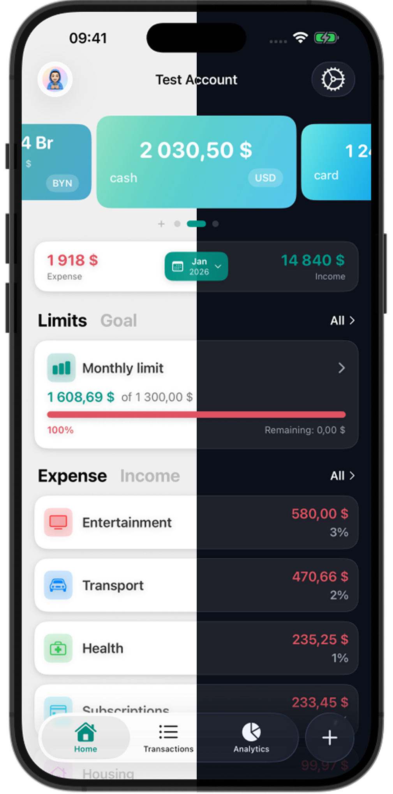

# LuCent: Premium Personal Finance Tracker

**LuCent** is a modern, privacy-first expense tracker for iOS designed for speed and elegance. Built with SwiftUI and Supabase, it offers an offline-first experience with seamless cloud sync.

  
  
  

🔗 **Download on the App Store:** [LuCent - Fast Expense Tracker](https://apps.apple.com/app/id6756549886)

---

## ✨ Features

- **Blazing Fast Entry:** Add transactions in seconds with a custom keypad and haptic feedback.
- **Offline First:** Your data is stored locally (SwiftData) and syncs silently when online.
- **Privacy Focused:** We don't sell your data. Secure sync via Supabase.
- **Smart Analytics:** Interactive charts to visualize spending habits.
- **Premium Design:** Dark mode native, custom themes, and polished animations.
- **Widgets:** Track your remaining budget directly from the Home Screen.

## � Tech Stack

- **Platform:** iOS 17+
- **Language:** Swift 5.9
- **UI Framework:** SwiftUI
- **Architecture:** MVVM + Clean Architecture
- **Local Database:** SwiftData (@Model)
- **Backend / Sync:** Supabase (Auth, Database, Realtime)
- **Monetization:** RevenueCat (Subscriptions & Lifetime)
- **Crash Reporting:** Sentry

## 📄 Privacy & Terms

- [Privacy Policy](docs/privacy.html)
- [Terms of Service](docs/terms.html)
- [Support & Contact](docs/contact.html)

---
© 2026 LuCent. Developed by Siarhei Nikalaichyk.
